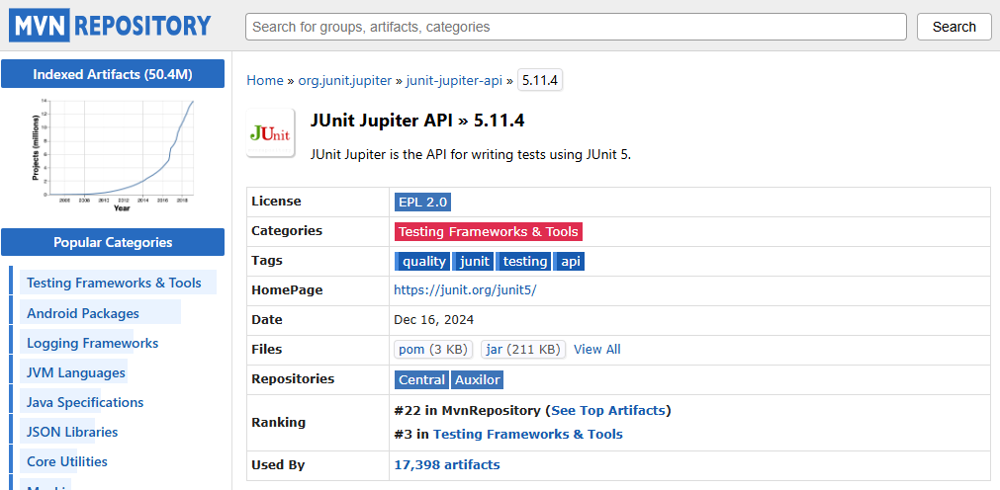

## Laboratorio #3 CVDS

### Integrantes

- Juan Andrés Rodríguez Peñuela
- Nicolás Pachón Unibio

### Crear Proyecto con Maven

El comando realizado en esta ocasión fue el siguiente

Que nos genero la siguiente estructura

### Agregar Dependencia Junit5

La dependencia utilizada fue **Junit Jupiter API 5.11.4**

Esta se decidio porque es la penultima versión, por lo cual en caso de encontrar un error, posee mas documentación e información al respecto comparado con la versión mas reciente.

Despues de ello, se procedio a agregar dicha dependencia en el *pom.xml* del proyecto

### Agregar Esqueleto del Proyecto

Ahora se añadieron de forma manual las siguientes carpetas:

- book
- loan
- user

Las cuales tambien se recrearon en la carpeta de *test* con el fin de poder realizar sus respectivas pruebas de unidad sin afectar el codigo original.

### Agregar Clases

#### Compilación Exitosa

### Pruebas Unitarias y TDD

### Crear Clase de Prueba

#### Pruebas Asociadas a _Book_

#### Pruebas Asociadas a _Loan_

#### Pruebas Asociadas a _User_

### Cobertura

La dependencia utilizada de jacoco fue **JaCoCo Maven Plugin 0.8.12**

Ahora a realizar la respectiva compilación del proyecto

Una vez compilado, procedemos a revisar que la cobertura fuera exitosa, la cual debe ser mayor al 80% para confirmar el exitoso desarrollo del laboratorio.

### Sonarqube

