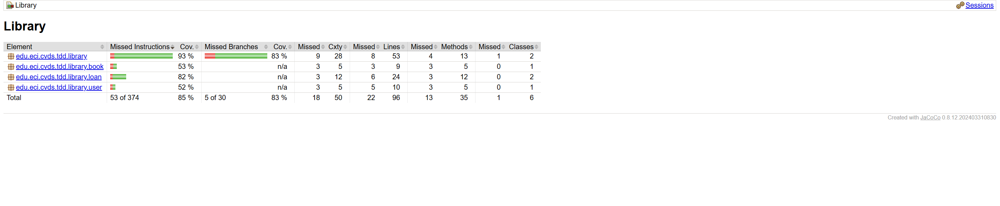

## Laboratorio #3 CVDS

### Integrantes

- Juan Andrés Rodríguez Peñuela
- Nicolás Pachón Unibio

### Crear Proyecto con Maven

En esta ocasión se trabajo con un proyecto de maven con el siguiente scaffolding:

El cual tiene la particularidad de tener dos carpetas similares, siendo _main_ en la cual se trabajo el codigo y demas implementaciones, mientras que _test_, como el nombre indica, es una copia del codigo presente en main para realizar las pruebas unitarias sin necesidad de realizar cambios en el codigo final.

### Agregar Dependencia Junit5

La dependencia utilizada fue **Junit Jupiter API 5.11.4**

Esta se decidio porque es la penultima versión, por lo cual en caso de encontrar un error, posee mas documentación e información al respecto comparado con la versión mas reciente.

Despues de ello, se procedio a agregar dicha dependencia en el *pom.xml* del proyecto

### Agregar Esqueleto del Proyecto

Ahora se añadieron de forma manual las siguientes carpetas:

- book
- loan
- user

Las cuales tambien se recrearon en la carpeta de _test_ con el fin de poder realizar sus respectivas pruebas de unidad sin afectar el codigo original.

### Agregar Clases

#### Compilación Exitosa

### Pruebas Unitarias y TDD

En esta ocasión una vez realizado el codigo y refactorizado, nos dio como resultado la aprobacion de las pruebas realizadas a los tres metodos asociados a la libreria. Lo cual nos garantiza que se cumplen las condiciones de negocio asociadas al comportamiento de la biblioteca 

### Crear Clase de Prueba

### Cobertura

La dependencia utilizada de jacoco fue **JaCoCo Maven Plugin 0.8.12**, la cual se aplico en el proyecto de la siguiente forma:

Asimismo,procedemos a volver a intentar las pruebas pero haciendo uso de jacoco en esta ocasión

Ahora a realizar la respectiva compilación del proyecto nos genero el siguiente reporte

El cual procedemos a revisar que la cobertura de las pruebas realizadas fuera exitosa, la cual debe ser mayor al 80% para confirmar el exitoso desarrollo del laboratorio.

Como podemos apreciar, se cumplio con la condición dada y por ende, las pruebas realizaron la cobertura deseada en el codigo

### Sonarqube

#### Inicialización sonarqube

#### Configuración en el pom.xml 

#### Token realizado por SonarQube

